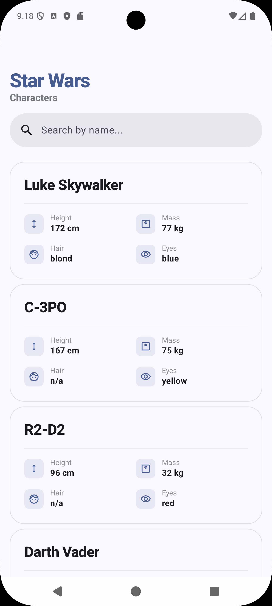
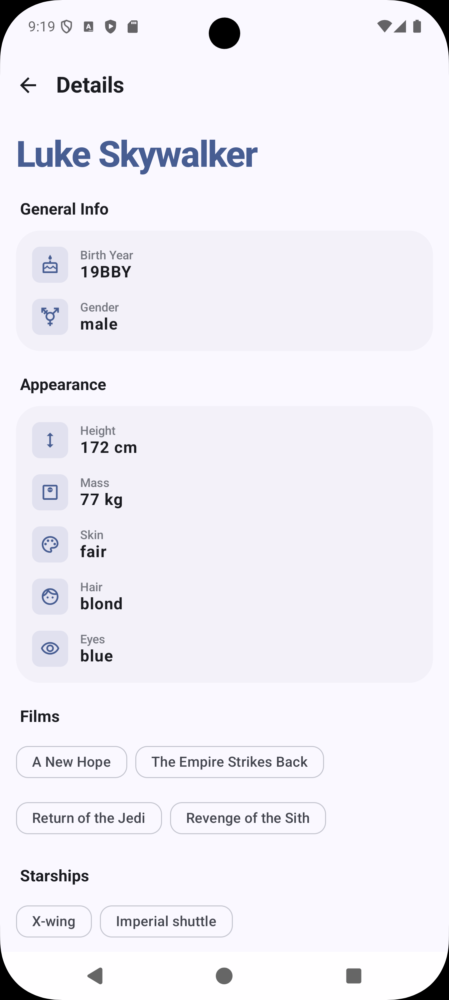

# Swapi (Star Wars API Client)

Современное Android-приложение для работы с [SWAPI](https://swapi.dev/), построенное на базе Jetpack Compose и принципах чистой архитектуры.

<p align="center">
  
  
</p>

## 🛠 Стек технологий

* **Language:** [Kotlin](https://kotlinlang.org/) + Coroutines & Flow.
* **UI:** [Jetpack Compose](https://developer.android.com/jetpack/compose) — декларативный интерфейс.
* **Navigation:** **Navigation3** — использование новейшего подхода к навигации от Google.
* **Dependency Injection:** [Hilt](https://developer.android.com/training/dependency-injection/hilt-android).
* **Network:** Retrofit + OkHttp + Kotlin Serialization.
* **Local Storage:** Room (полная поддержка offline-режима).
* **Architecture:** Clean Architecture (MVVM) с разделением на слои Data, Domain и Presentation.

## 🏗 Архитектура и подход к модульности

Проект организован с четким разделением ответственности. На данный момент используется структура внутри одного модуля, разделенная на логические блоки:

* **`core`**: Базовый слой приложения. Содержит общие компоненты DI, настройки БД, сетевой клиент и базовые элементы домена, которые используются всеми фичами.
* **`feature`**: Слой функциональных модулей (пакеты `list` и `detail`). Каждый пакет инкапсулирует логику конкретного экрана, обеспечивая высокую связность (high cohesion).

### Почему все в одном модуле :app?
Несмотря на то, что приложение готово к разделению на модули, текущий подход выбран намеренно:
1.  Нет выгоды заниматься настройкой gradle скриптов сборки и плагинов
2.  В рамках одного модуля рефакторинг и навигация осуществляются быстрее.
3.  Текущая иерархия пакетов позволяет разнести код по разным модулям за считанные минуты, как только объем потребует параллельной сборки.

## 🚀 Как запустить

1.  Клонируйте репозиторий:
    ```bash
    git clone https://github.com/EGOr-ProGrammar/Swapi.git
    ```
2.  Откройте проект в **Android Studio**.
3.  Выполните синхронизацию Gradle и запустите приложение на устройстве.
